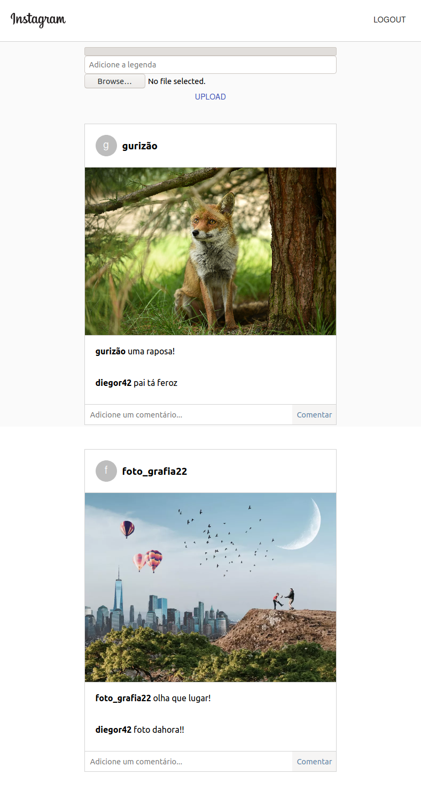

# Este é um projeto em React para estudos onde imita a interface estilizada para parecer o Instagram, utilizando o Firebase.

## O que ele faz?
-Cria e gerencia autenticação de usuário (utilizando o Firebase)

-Faz upload de imagens, Posts, com legenda (armazenadas no Storage do Firebase)

-Permite comentários para cada Post

  

(obviamente requer Node.js, ok? ...então prepare seu ambiente 😃 )

Após clonar o repositório, instalar as dependências:

**npm install -save @material-ui/core**

**npm i firebase**

(não esqueça o sudo se estiver no Linux 😉)

no terminal, vá até a pasta do projeto:

**cd ~ user ~/projetos/react-instagram-clone**

inicie o projeto:

**npm start**

divirta-se!
